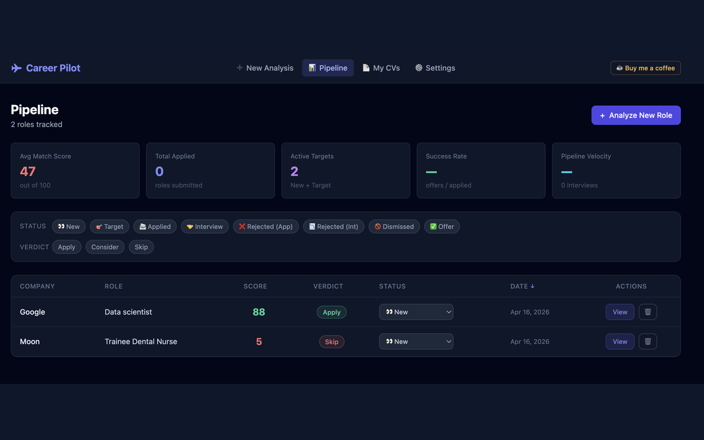
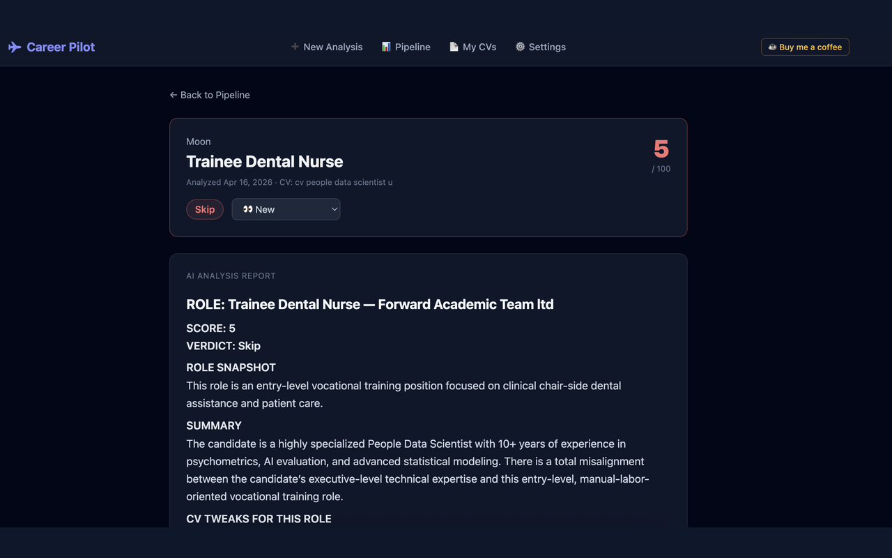

# ✈ Career Pilot

**AI-powered job fit analyser for senior professionals.**

Paste a job description — or use the Chrome extension to import it from any job board — and get an instant report: a match score (0–100), a go/no-go verdict, tailored CV tweaks, and ATS keywords. The analysis runs against your actual CV and your hidden career context (focus, dealbreakers, unlisted talents) that never appears on paper. Everything stays in your browser. No accounts, no database.

🔗 **Live app:** [cv-matcher-azure.vercel.app](https://cv-matcher-azure.vercel.app)
🧩 **Chrome extension:** [Install from Chrome Web Store](https://chromewebstore.google.com/detail/fjhgkajgdhdiagfmcmaomijcghbohlcd)

---




---

## Evaluation

The scoring system has been independently evaluated using psychometric methods (criterion validity, reliability, fairness) and AI/ML evaluation methods (ranking quality, prompt sensitivity, cross-model benchmarking).

**Key findings:** Strong ranking quality (NDCG@5 = 0.956), near-perfect test-retest reliability (ICC = 0.994), and a structural mid-range scoring pattern that concentrates uncertainty in a single score cluster — revealing where the system's limits are and why.

> 📊 **Full evaluation:** [github.com/Holly-olly/llm-cv-screener-eval](https://github.com/Holly-olly/llm-cv-screener-eval)

---

## What It Does

| Feature | Description |
|---|---|
| **AI Fit Score** | 0–100 match against your CV and hidden context |
| **Verdict** | Apply / Consider / Skip |
| **CV Tweaks** | Role-specific suggestions |
| **ATS Keywords** | Terms to add to your CV to pass screening |
| **Pipeline Dashboard** | Track every role: status, score, verdict |
| **Multiple CV versions** | Switch between tailored CV versions per application |
| **CV upload** | PDF, Word, TXT, RTF — text extracted automatically |
| **Chrome Extension** | One-click import from LinkedIn, Indeed, Glassdoor, any careers page |
| **No account needed** | All data in browser localStorage — private by default |

---

## Running Locally

**Prerequisites:** Node.js 18+, a free [Gemini API key](https://aistudio.google.com/app/apikey)

```bash
git clone https://github.com/Holly-olly/career-pilot.git
cd career-pilot/app
npm install
echo "VITE_GEMINI_API_KEY=your_key_here" >> .env.local
npm run dev
```

Open [http://localhost:5173](http://localhost:5173).

---

## Chrome Extension

1. Open `chrome://extensions` → enable **Developer mode**
2. Click **Load unpacked** → select the `app/extension/` folder
3. Go to any job posting → click the Career Pilot icon → **Send to Career Pilot**

The extension is published on the Chrome Web Store: [Install Career Pilot](https://chromewebstore.google.com/detail/fjhgkajgdhdiagfmcmaomijcghbohlcd)

---

## Tech Stack

React 18 · Vite · Tailwind CSS · Google Gemini API · Vercel (serverless) · Chrome Manifest V3 · pdfjs-dist · mammoth

---

## Privacy

No data leaves your browser except the AI call to Google's API using your own key. No analytics, no tracking, no accounts. [Privacy policy](https://cv-matcher-azure.vercel.app/privacy.html).

---

## Contribute to the Research

Career Pilot is part of an ongoing evaluation study. If you use the app and track whether applications led to interviews or offers, that outcome data helps validate the scoring system.

> 📊 **Evaluation project:** [github.com/Holly-olly/llm-cv-screener-eval](https://github.com/Holly-olly/llm-cv-screener-eval)

---

Free to use for job searching or research. If you find this useful, [buy me a coffee ☕](https://ko-fi.com/V7V11WRGZX).

*Built with [Claude Code](https://claude.ai/claude-code)*
